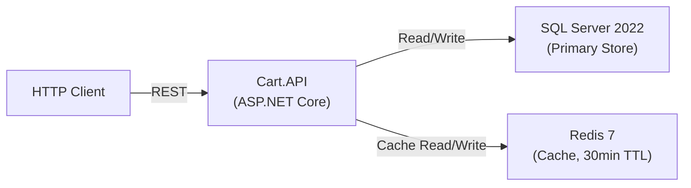
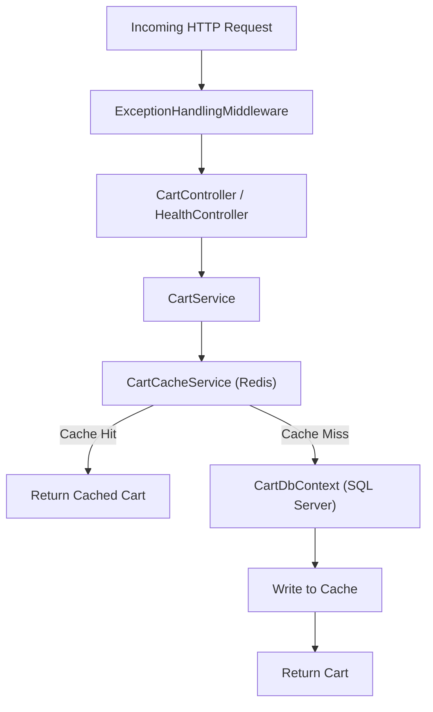

# Cart Service

Shopping-cart microservice built with ASP.NET Core (.NET 10), SQL Server, and Redis.

## Technology Stack

| Layer | Technology | Version | Purpose |
|---|---|---|---|
| Runtime / Framework | ASP.NET Core | .NET 10 | Web API framework |
| Language | C# | 13 | Primary language |
| ORM | Entity Framework Core | 10.0.5 | Database access (SQL Server provider) |
| Primary Database | SQL Server | 2022 | Persistent storage for carts and items |
| Cache | Redis | 7 | Read-through cache (30-min TTL) |
| Redis Client | StackExchange.Redis | 2.12.1 | .NET Redis client |
| API Docs | Swashbuckle (Swagger) | 10.1.5 | Auto-generated OpenAPI UI |
| Containerization | Docker + Docker Compose | Multi-stage build | Orchestrates all services |

## Architecture



### Request Pipeline



### Data Flow

- **GET cart** -- Check Redis first. On cache hit, return immediately. On cache miss, query SQL Server via EF Core, populate Redis, then return.
- **POST create cart** -- Insert into SQL Server, write to Redis, return the new cart.
- **POST add item** -- Load cart from SQL Server (with change tracking), add or update item, save to SQL Server, update Redis, return.
- **DELETE remove item** -- Load cart from SQL Server, remove item, save, update Redis, return.

## Project Structure

```
cart-service/
├── Cart.API/
│   ├── Contracts/          # Request/Response DTOs
│   │   ├── CreateCartRequest.cs
│   │   ├── AddCartItemRequest.cs
│   │   ├── CartResponse.cs
│   │   └── CartItemResponse.cs
│   ├── Controllers/
│   │   ├── CartController.cs         # CRUD endpoints
│   │   └── HealthController.cs       # GET /Health
│   ├── Data/
│   │   └── CartDbContext.cs          # EF Core context, Fluent API mapping
│   ├── Middleware/
│   │   └── ExceptionHandlingMiddleware.cs  # Global error handler (Problem Details)
│   ├── Models/
│   │   ├── Cart.cs                   # ShoppingCart entity
│   │   └── CartItem.cs              # CartItem entity
│   ├── Services/
│   │   ├── ICartService.cs           # Business logic interface
│   │   ├── CartService.cs            # Implementation (DB + cache orchestration)
│   │   ├── ICartCacheService.cs      # Cache interface
│   │   └── CartCacheService.cs       # Redis implementation (30-min TTL)
│   ├── Program.cs                    # DI setup, middleware, Swagger
│   ├── appsettings.json              # Connection strings
│   └── appsettings.Development.json
├── db/
│   └── init.sql                      # Creates cartdb, tables, seeds demo data
├── Dockerfile                        # Multi-stage .NET 10 build
├── docker-compose.yml                # sqlserver + db-init + redis + cart-api
└── README.md
```

## API Endpoints

| Method | Route | Body | Description |
|---|---|---|---|
| `POST` | `/Cart` | `{ "userId": "string" }` (optional) | Create a new cart |
| `GET` | `/Cart/{id}` | -- | Get a cart by GUID |
| `POST` | `/Cart/{id}/items` | `AddCartItemRequest` (see below) | Add an item to a cart |
| `DELETE` | `/Cart/{id}/items/{productId}` | -- | Remove an item by productId |
| `GET` | `/Health` | -- | Health check |

### AddCartItemRequest

All fields are required:

| Field | Type | Constraints |
|---|---|---|
| `productId` | int | >= 1 |
| `productName` | string | min length 1 |
| `quantity` | int | 1 -- 10,000 |
| `price` | decimal | >= 0.01 |
| `currency` | string | min length 1, default `"EUR"` |

## Database Schema

Defined in `db/init.sql` and mapped via EF Core Fluent API in `Cart.API/Data/CartDbContext.cs`.

**dbo.carts**

| Column | Type | Notes |
|---|---|---|
| `id` | UNIQUEIDENTIFIER | Primary key |
| `user_id` | NVARCHAR(100) | Nullable |
| `created_at` | DATETIME2 | Default `SYSUTCDATETIME()` |
| `updated_at` | DATETIME2 | Default `SYSUTCDATETIME()` |

**dbo.cart_items**

| Column | Type | Notes |
|---|---|---|
| `id` | INT IDENTITY | Primary key |
| `cart_id` | UNIQUEIDENTIFIER | FK to `carts(id)`, CASCADE DELETE |
| `product_id` | INT | |
| `product_name` | NVARCHAR(200) | |
| `quantity` | INT | |
| `price` | DECIMAL(10,2) | |
| `currency` | NVARCHAR(10) | Default `'EUR'` |

A demo cart (`11111111-1111-1111-1111-111111111111`) with two items is seeded automatically.

## Design Patterns

- **Service pattern** -- `ICartService` / `CartService` abstracts business logic from the controller.
- **Cache-aside** -- Redis is checked first on reads; written to after every write. 30-minute TTL prevents stale data.
- **Interface segregation** -- `ICartCacheService` is separate from `ICartService`, making it easy to swap cache implementations.
- **Global exception handling** -- `ExceptionHandlingMiddleware` catches unhandled exceptions and returns RFC 7807 Problem Details JSON.
- **DTO separation** -- Request/response contracts are separate from domain models.

## Getting Started

### Prerequisites

- [Docker](https://www.docker.com/get-started)
- [.NET 10 SDK](https://dotnet.microsoft.com/download) (only for local development)

### Run with Docker Compose (recommended)

```bash
docker compose up --build -d
```

This starts four containers:

1. **cart-sqlserver** -- SQL Server 2022 on port `1433`
2. **cart-db-init** -- runs `init.sql` to create the database and seed data (exits after completion)
3. **cart-redis** -- Redis 7 on port `6379`
4. **cart-api** -- the ASP.NET Core app on port `5000`

Wait ~30 seconds for SQL Server health checks and DB initialization. The API is then available at **http://localhost:5000**.

### Run Locally

Ensure SQL Server is running on `localhost:1433` and Redis on `localhost:6379`, then run the init script against SQL Server manually:

```bash
cd Cart.API
dotnet run
```

The app will start on `http://localhost:5288` (per `launchSettings.json`).

## Configuration

| Variable | Default | Description |
|---|---|---|
| `ConnectionStrings__SqlServer` | *(see docker-compose.yml)* | SQL Server connection string |
| `ConnectionStrings__Redis` | `redis:6379` | Redis connection string |
| `ASPNETCORE_ENVIRONMENT` | `Development` | Runtime environment |

## Testing Guide

### 1. Verify the service is running

```bash
curl http://localhost:5000/Health
```

Expected: `{"status":"healthy"}`

### 2. Open Swagger UI

Navigate to **http://localhost:5000/swagger** in a browser for an interactive API explorer.

### 3. Fetch the pre-seeded demo cart

```bash
curl http://localhost:5000/Cart/11111111-1111-1111-1111-111111111111
```

Expected: a JSON cart containing "Demo Sneakers" (qty 2, 79.99 EUR) and "Demo Hoodie" (qty 1, 49.50 EUR).

### 4. Create a new cart

```bash
curl -X POST http://localhost:5000/Cart \
  -H "Content-Type: application/json" \
  -d '{"userId": "test-user-1"}'
```

Expected: `201 Created` with a new cart object. Copy the returned `id` GUID for the next steps.

### 5. Add an item

Replace `{CART_ID}` with the GUID from step 4:

```bash
curl -X POST http://localhost:5000/Cart/{CART_ID}/items \
  -H "Content-Type: application/json" \
  -d '{"productId": 42, "productName": "T-Shirt", "quantity": 3, "price": 19.99, "currency": "EUR"}'
```

Expected: `200 OK` with the cart now including the T-Shirt item.

### 6. Add the same product again (quantity merging)

```bash
curl -X POST http://localhost:5000/Cart/{CART_ID}/items \
  -H "Content-Type: application/json" \
  -d '{"productId": 42, "productName": "T-Shirt", "quantity": 2, "price": 19.99, "currency": "EUR"}'
```

Expected: the item with `productId: 42` now has `quantity: 5` (3 + 2).

### 7. Remove an item

```bash
curl -X DELETE http://localhost:5000/Cart/{CART_ID}/items/42
```

Expected: `200 OK` with the cart, now without the T-Shirt item.

### 8. Test error handling

Request a non-existent cart:

```bash
curl http://localhost:5000/Cart/00000000-0000-0000-0000-000000000000
```

Expected: `404 Not Found`.

Send invalid item data:

```bash
curl -X POST http://localhost:5000/Cart/{CART_ID}/items \
  -H "Content-Type: application/json" \
  -d '{"productId": 0, "productName": "", "quantity": 0, "price": 0}'
```

Expected: `400 Bad Request` with validation errors.

### 9. Verify Redis caching

After fetching a cart, confirm it was cached:

```bash
docker exec -it cart-redis redis-cli GET "cart:11111111-1111-1111-1111-111111111111"
```

Expected: a JSON-serialized cart string.

## Cleanup

```bash
docker compose down -v
```

The `-v` flag removes the SQL Server data volume for a clean slate.
